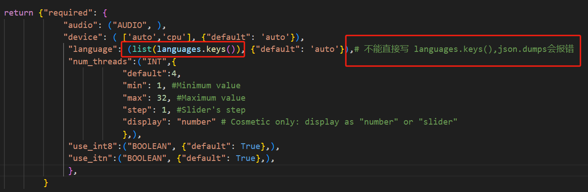

# 7-Day-AI-Code-Challenge
每天一小步，代码一大步。 One small step each day, one giant leap in code.

[Day 01 web 工具](https://shadowcz007.github.io/7-Day-AI-Code-Challenge/NationalDayAvatar)

[Day 02 expo]()
https://docs.expo.dev/guides/environment-variables/

[Day 03 ComfyUI节点开发] 
报错信息：

找出报错的数据

LLM指出具体的错误

解决bug

继续修bug

[Day 04 单词记忆卡](./Englishflashcard/)
https://v0.dev/chat/iGLtTxbld8W

claude-dev 完成了大部分

接下来是人脑

